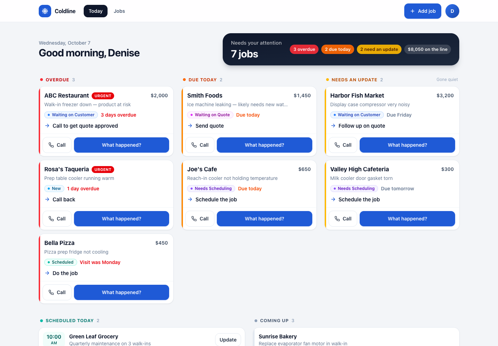
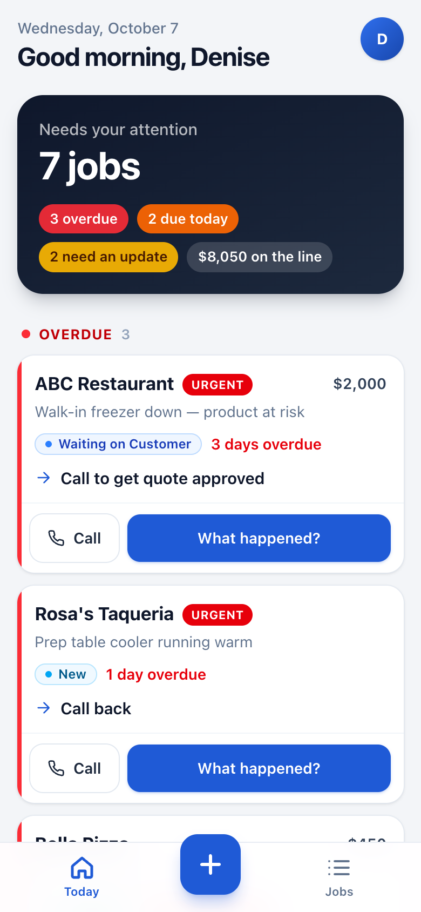
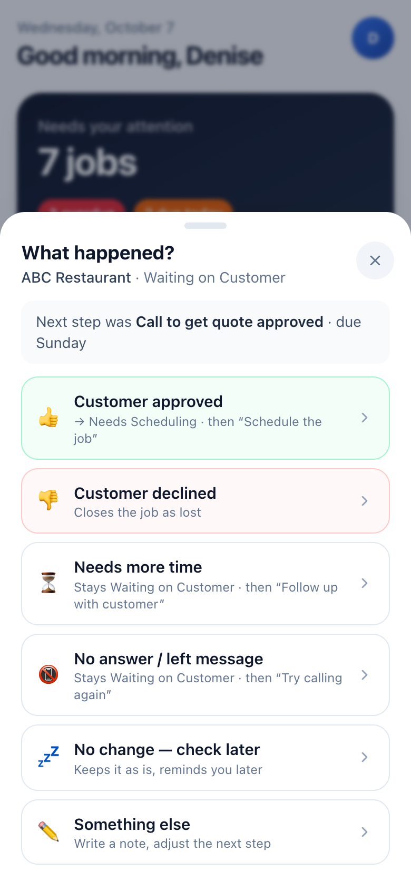
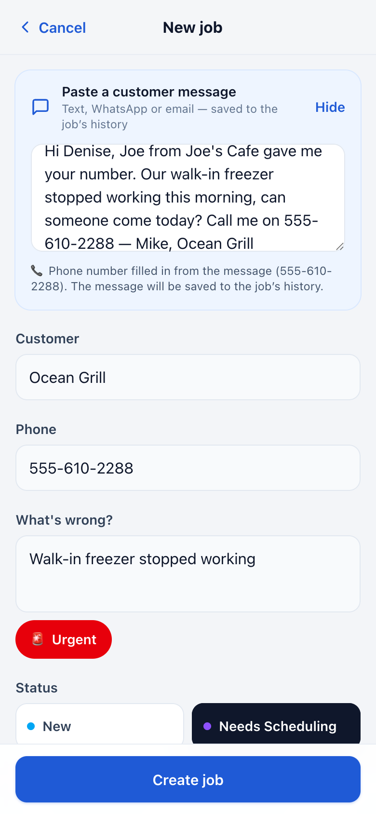
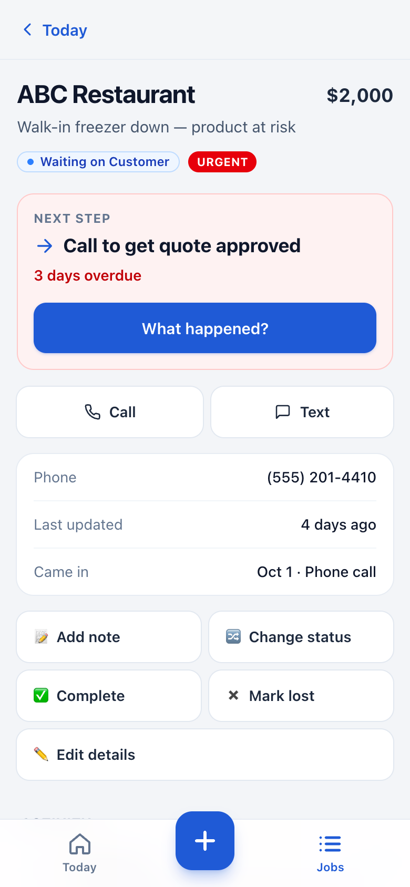
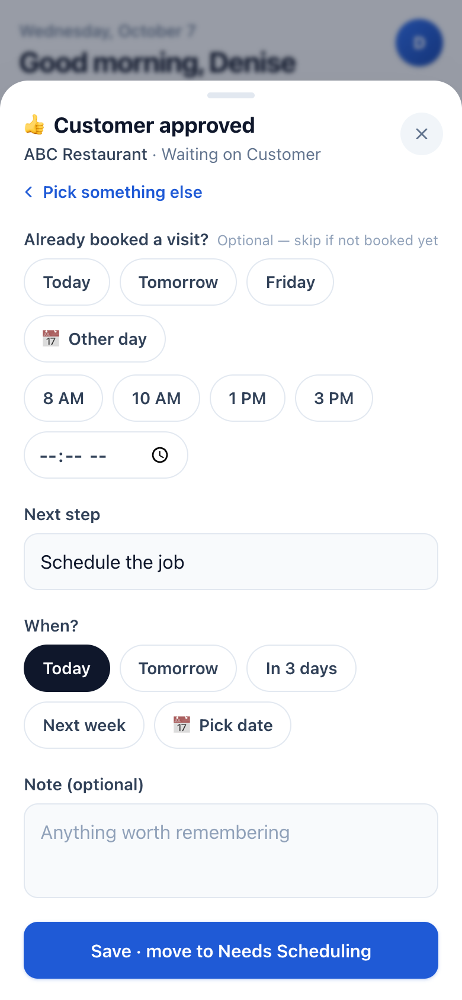
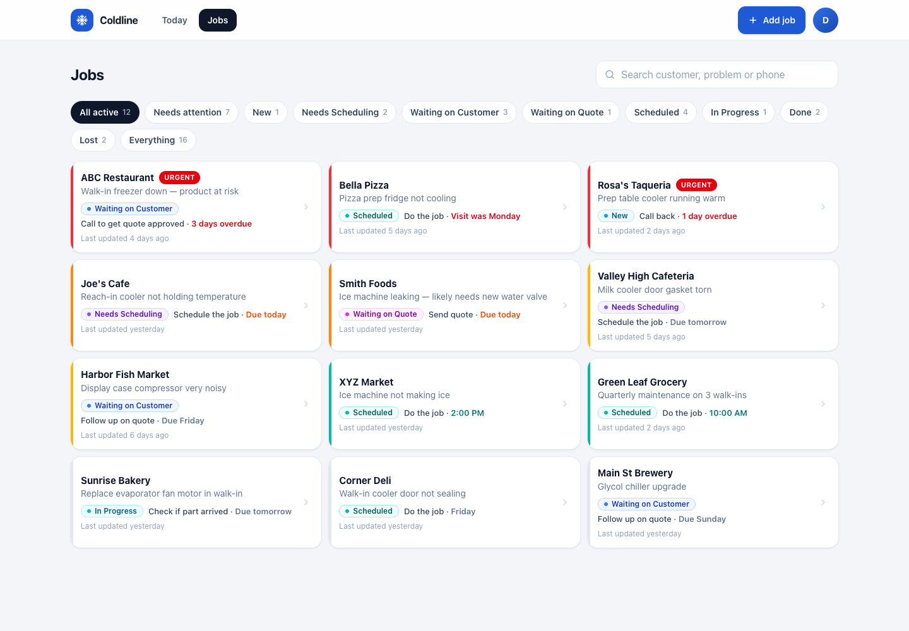

# Coldline

**A job follow-up app for a small commercial refrigeration business.** Open it in the morning and within five seconds you know which jobs need you today, and nothing gets forgotten.

**Live demo: [coldline-psi.vercel.app](https://coldline-psi.vercel.app)**. The demo login is pre-filled; just tap *Sign in*. Works on a phone or a laptop.



<table>
  <tr>
    <td></td>
    <td></td>
    <td></td>
    <td></td>
  </tr>
  <tr>
    <td align="center"><sub>Morning dashboard</sub></td>
    <td align="center"><sub>“What happened?”</sub></td>
    <td align="center"><sub>Add a job</sub></td>
    <td align="center"><sub>Job detail</sub></td>
  </tr>
</table>

---

## The problem

Denise runs a refrigeration repair company with four technicians. Work comes in by phone, website form, repeat customers and referrals over text and WhatsApp, and it ends up spread across her phone and a paper notebook. Jobs get forgotten. In one real case, a restaurant called on a Friday about a freezer that was down. Nobody followed up over the weekend, and by Monday a **~$2,000 job** was gone.

So the app is built around one promise:

> **When Denise starts her day, she immediately knows what needs her attention and where every active job stands.**

It is deliberately **not** a field-service platform. It has no invoicing, dispatch, GPS or push notifications. The morning dashboard *is* the reminder.

## What it does

| | |
|---|---|
| 🗓 **Morning dashboard** | Overdue, due today and gone-quiet jobs are listed first, then today's visits and what's coming up. A headline card shows how many jobs need her and how much money is at stake. |
| ➡️ **A next action on every job** | Every active job answers: *What is it? Where is it? What's next? When?* The dashboard is driven by next actions, not by status alone. |
| ⚠️ **Stale detection** | A job nobody has updated for a few days is flagged for an update. The app never assumes a quiet job is still on track. |
| 💬 **“What happened?” updates** | Instead of editing statuses, Denise taps what happened (*Customer approved*, *No answer*, *Visit booked*…). The app sets the new status, next step and due date. |
| ⚡ **Fast job entry** | Only four fields are required. The next step fills itself in, repeat customers are recognised, and a pasted text or WhatsApp message is saved to the job. |
| 📜 **Activity history** | Every change is logged, so a job she hasn't looked at for a week still makes sense. |
| 📱 **Phone first, desktop too** | Built for a phone, with large tap targets and bottom sheets, and installable to the home screen. On a laptop it spreads into columns. |

---

## How it decides what needs attention

Every active job lands in exactly **one** dashboard section (`src/lib/attention.ts`):

| Section | Rule |
|---|---|
| 🔴 **Overdue** | The next-action date has passed, or a booked visit date has passed and the job was never updated (“Visit was Monday”). |
| 🟠 **Due today** | The next action is due today. |
| 🟡 **Needs an update** | No activity for longer than the status allows, or no next step at all, even if nothing is due yet. |
| 🟢 **Scheduled today** | Today's technician visits, by time. |
| ⚪ **Coming up** | Everything else that's still open. |

In Overdue and Due today, urgent jobs come first, then the most overdue or most valuable. Needs an update lists the longest-silent jobs first. Done and Lost jobs leave the dashboard but stay in the job list and history.

### Stale jobs

Denise often handles things outside the app; a customer might call to decline, for example. If she forgets to record it, the job goes quiet. Rather than assume it's progressing, the app moves it to **Needs an update** once it has been silent too long. The limits are per status and live in one place:

```ts
// src/lib/config.ts
export const STALE_AFTER_DAYS = {
  new: 1,                 // the "forgotten Friday call": never let a new request sit
  needs_scheduling: 2,
  waiting_on_quote: 2,
  waiting_on_customer: 3,
  in_progress: 3,
  scheduled: null,        // judged by the visit date instead
  ...
};
```

### “What happened?”



The main button on every job asks **What happened?** and only offers answers that make sense for the job's current status (`src/lib/workflow.ts`). Picking one fills in the new status, next step and due date. Denise can adjust them before saving, and the change is added to the job's history.

| Current status | Answers |
|---|---|
| New | Talked, needs a visit · Visit booked · Needs a quote · No answer · Declined |
| Needs Scheduling | Visit booked · No answer · Needs more time · Declined |
| Scheduled | Job completed · Visited, needs more work · Needs rescheduling · Cancelled |
| Waiting on Quote | Quote sent (with amount) · Declined |
| Waiting on Customer | Approved (can book the visit right away) · Declined · Needs more time · No answer |
| In Progress | Job completed · Waiting on parts · Return visit booked |
| *any open job* | No change, check later (snooze) · Something else (note required) |

For corrections, the job page also has **Change status**, **Add note**, **Complete**, **Mark lost**, **Edit details** and **Reopen**.

<br clear="right">

### Adding a job

Only **customer, phone, what's wrong and status** are required. The next action and due date are filled in from the status, and a repeat customer's phone number fills in when she picks their name. After saving, the dashboard opens with the new job highlighted in its section.

**Paste a customer message:** a text, WhatsApp message or email can be pasted in. It's saved to the job's history, and the phone number in it is filled in automatically. Nothing else is guessed, because names and problem descriptions vary too much between messages for simple rules. `extractFromMessage` in `src/lib/extract.ts` is the one place where an AI step or a real WhatsApp integration would plug in later.

### Desktop

On screens 1024px and wider the app gets a top bar (Today, Jobs, **+ Add job**, profile). The dashboard shows **Overdue, Due today and Needs an update side by side**. The jobs list becomes a grid, and the job page moves its history into a right-hand column.



---

## Run it locally

Requires **Node 20+** and **Docker Desktop** (for the local Supabase database).

```bash
npm install
cp .env.example .env.local    # defaults already point at local Supabase
npm run db:start              # starts Supabase, creates tables, demo jobs and the login
npm run dev                   # http://localhost:3000
```

Sign in with the demo account (the form is pre-filled):

- **Email:** `denise@example.com`
- **Password:** `followup123`

The 15 demo jobs are dated **relative to the day they're loaded**, so the dashboard always shows overdue, due-today, quiet and scheduled-today work. They age like real jobs. To start fresh, use **profile → Reset demo data** or run `npm run db:reset`.

| Command | |
|---|---|
| `npm run dev` | Development server |
| `npm test` | Unit tests (Vitest) |
| `npm run build` | Production build (also type-checks) |
| `npm run lint` | ESLint |
| `npm run db:start` / `db:stop` / `db:reset` | Local Supabase |

**Troubleshooting**
- *“Can't reach the database”* on login, or `Cannot connect to the Docker daemon`: start Docker Desktop, then `npm run db:start`.
- *“Another next dev server is already running”*: one is already up for this folder; open the URL it prints or stop it first.

## Tests

`npm test` runs the unit tests for the rules that matter most:

- **Dates:** timezone conversion, including daylight-saving days; “today” in Denise's timezone vs. the server's; relative day names.
- **Dashboard rules:** overdue, due today, stale thresholds per status, missing next step, past visits, closed jobs, section ordering, value at stake.
- **“What happened?”:** every open status has sensible answers, and every answer that keeps a job open gives it a next step.
- **Phone detection** in pasted messages, including not matching longer numbers.

## Deploy

The app is two pieces: the **database and login** on [Supabase](https://supabase.com), and the **website** on [Vercel](https://vercel.com). Both have free plans.

1. **Supabase:** create a project, then from this folder:
   ```bash
   npx supabase login
   npx supabase link              # pick the project
   npx supabase db push --include-seed
   ```
   This creates the tables, the demo jobs and the `denise@example.com` login. Copy the **Project URL** and **anon key** from *Project Settings → API*.
2. **GitHub:** push this repo.
3. **Vercel:** import the repo and set these environment variables, then deploy:

   | Variable | Value |
   |---|---|
   | `NEXT_PUBLIC_SUPABASE_URL` | Supabase Project URL |
   | `NEXT_PUBLIC_SUPABASE_ANON_KEY` | Supabase anon key |
   | `NEXT_PUBLIC_BUSINESS_TZ` | e.g. `America/Chicago` |
   | `NEXT_PUBLIC_SHOW_DEMO_LOGIN` | leave unset for a demo; `false` for real use (stops pre-filling the login) |

Before sharing a demo link, use **Reset demo data** so the dates are fresh.

---

## Tech stack

- **Next.js 16** (App Router, Server Components, Server Actions) with **TypeScript**
- **Tailwind CSS 4**
- **Supabase**: PostgreSQL, Auth, row-level security
- **Vitest** for unit tests
- Installable **PWA**; deploys to **Vercel** as-is

It's one repository and one app, with no separate backend, queues or other infrastructure.

### Data model

| Table | Key columns |
|---|---|
| `customers` | `name`, `phone`, `phone_digits` (generated; used to recognise repeat customers) |
| `jobs` | `status`, `issue`, `priority`, `source`, `estimated_value`, **`next_action`**, **`next_action_due_on`**, `scheduled_at`, **`last_updated_at`**, `closed_at` |
| `activities` | `job_id`, `type`, `note`, `created_at`: the job's history |

Every change goes through a server action (`src/app/actions.ts`) that updates the job, bumps `last_updated_at` and writes an activity entry.

### Project layout

```
supabase/
  migrations/…_init.sql          tables, row-level security, triggers
  migrations/…_demo_data.sql     reset_demo_data(tz): 15 demo jobs with relative dates
  seed.sql                       demo login + demo data
src/
  app/
    page.tsx                     dashboard
    jobs/page.tsx                job list: filters + search
    jobs/new/                    Add Job (+ paste a message)
    jobs/[id]/                   job detail, actions, history
    actions.ts                   every change to data (server actions)
    login/, setup/               sign-in; setup screen if env vars are missing
  lib/
    attention.ts                 which dashboard section each job belongs in
    workflow.ts                  statuses, default next actions, “What happened?” answers
    config.ts                    owner name, timezone, stale thresholds
    dates.ts                     day math in the business timezone
    extract.ts                   phone number from a pasted message
    *.test.ts                    unit tests
  components/                    cards, bottom sheets, pickers, nav, toasts
  proxy.ts                       sign-in guard
```

## Design decisions

- **Next actions over statuses.** Statuses alone don't tell Denise what to do. Every open job always carries a next action and a due date, and the dashboard is built from those.
- **Surface uncertainty.** Quiet jobs, past visits that were never closed out and jobs with no next step are pulled into view rather than assumed to be fine.
- **Times in Denise's timezone.** Servers run in UTC, so “today” and “overdue” are always worked out in `NEXT_PUBLIC_BUSINESS_TZ`. Due dates are stored as plain dates and visits as exact times.
- **Always current when opened.** Phones resume apps from memory instead of reloading them. The app re-fetches its data when it comes back to the foreground after a few minutes, or when the day changes, so the morning view is never yesterday's.
- **Simple auth.** It's one business, so any signed-in user sees every job. Roles can come later.
- **Next.js 16.** On Next 15.5 the screen sometimes didn't update after an action until something else re-rendered (about 3 seconds). Upgrading fixed it, and updates now land in about 200ms.

## Not built (on purpose)

Push notifications, native apps, technician GPS or routing, invoicing, inventory, calendar sync, real WhatsApp/email/website ingestion, AI chat and multi-company admin. They're outside the core problem, which is not letting unresolved jobs disappear.

## What I'd do next

1. **Smarter message capture:** use an AI step to read the customer, problem and urgency from pasted messages, then connect WhatsApp Business so messages become draft jobs automatically.
2. **Technician view:** let the four technicians see their visits and tap “Job completed” on site, so Denise doesn't have to relay it.
3. **Optional morning summary** by email or text, for days Denise doesn't open the app.
4. **Settings screen** for stale thresholds and the business timezone, instead of editing code.
